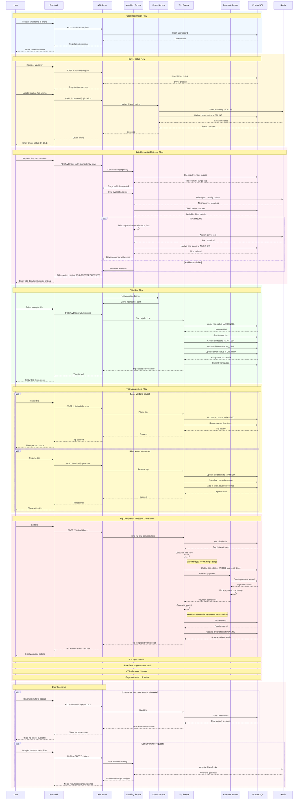

```mermaid
sequenceDiagram
    participant U as User
    participant FE as Frontend
    participant API as API Server
    participant MS as Matching Service
    participant DS as Driver Service
    participant TS as Trip Service
    participant PS as Payment Service
    participant DB as PostgreSQL
    participant R as Redis

    %% User Registration Flow
    rect rgb(240, 248, 255)
        Note over U,DB: User Registration Flow
        U->>FE: Register with name & phone
        FE->>API: POST /v1/users/register
        API->>DB: Insert user record
        DB-->>API: User created
        API-->>FE: Registration success
        FE-->>U: Show user dashboard
    end

    %% Driver Registration & Online Flow
    rect rgb(255, 248, 220)
        Note over U,DB: Driver Setup Flow
        U->>FE: Register as driver
        FE->>API: POST /v1/drivers/register
        API->>DB: Insert driver record
        DB-->>API: Driver created
        API-->>FE: Registration success

        U->>FE: Update location (go online)
        FE->>API: POST /v1/drivers/{id}/location
        API->>DS: Update driver location
        DS->>R: Store location (GEOADD)
        DS->>DB: Update driver status to ONLINE
        R-->>DS: Location stored
        DB-->>DS: Status updated
        DS-->>API: Success
        API-->>FE: Driver online
        FE-->>U: Show driver status: ONLINE
    end

    %% Ride Creation & Matching Flow
    rect rgb(255, 240, 245)
        Note over U,R: Ride Request & Matching Flow
        U->>FE: Request ride with locations
        FE->>API: POST /v1/rides (with idempotency key)
        API->>MS: Calculate surge pricing
        MS->>DB: Check active rides in area
        DB-->>MS: Ride count for surge calc
        MS->>API: Surge multiplier applied

        API->>MS: Find available drivers
        MS->>R: GEO query nearby drivers
        R-->>MS: Nearby driver locations
        MS->>DB: Check driver statuses
        DB-->>MS: Available driver details

        alt Driver found
            MS->>MS: Select optimal driver (distance, tier)
            MS->>R: Acquire driver lock
            R-->>MS: Lock acquired
            MS->>DB: Update ride status to ASSIGNED
            DB-->>MS: Ride updated
            MS->>API: Driver assigned with surge
        else No driver available
            MS->>API: No driver available
        end

        API-->>FE: Ride created (status: ASSIGNED/REQUESTED)
        FE-->>U: Show ride details with surge pricing
    end

    %% Driver Acceptance & Trip Start Flow
    rect rgb(240, 255, 240)
        Note over U,DB: Trip Start Flow
        API->>DS: Notify assigned driver
        DS->>API: Driver notification sent

        U->>FE: Driver accepts ride
        FE->>API: POST /v1/drivers/{id}/accept
        API->>TS: Start trip for ride
        TS->>DB: Verify ride status (ASSIGNED)
        DB-->>TS: Ride verified
        TS->>DB: Start transaction

        TS->>DB: Create trip record (STARTED)
        TS->>DB: Update ride status to IN_TRIP
        TS->>DB: Update driver status to ON_TRIP
        DB-->>TS: All updates successful
        TS->>DB: Commit transaction

        TS-->>API: Trip started successfully
        API-->>FE: Trip started
        FE-->>U: Show trip in progress
    end

    %% Trip Management Flow
    rect rgb(255, 250, 205)
        Note over U,DB: Trip Management Flow
        alt User wants to pause
            U->>FE: Pause trip
            FE->>API: POST /v1/trips/{id}/pause
            API->>TS: Pause trip
            TS->>DB: Update trip status to PAUSED
            TS->>DB: Record pause timestamp
            DB-->>TS: Trip paused
            TS-->>API: Success
            API-->>FE: Trip paused
            FE-->>U: Show paused status
        end

        alt User wants to resume
            U->>FE: Resume trip
            FE->>API: POST /v1/trips/{id}/resume
            API->>TS: Resume trip
            TS->>DB: Update trip status to STARTED
            TS->>DB: Calculate paused duration
            TS->>DB: Add to total_paused_seconds
            DB-->>TS: Trip resumed
            TS-->>API: Success
            API-->>FE: Trip resumed
            FE-->>U: Show active trip
        end
    end

    %% Trip Completion & Payment Flow
    rect rgb(255, 235, 235)
        Note over U,DB: Trip Completion & Receipt Generation
        U->>FE: End trip
        FE->>API: POST /v1/trips/{id}/end
        API->>TS: End trip and calculate fare
        TS->>DB: Get trip details
        DB-->>TS: Trip data retrieved

        TS->>TS: Calculate final fare
        Note right of TS: Base fare ($2 + $0.5/min) + surge
        TS->>DB: Update trip (status: ENDED, fare, end_time)

        TS->>PS: Process payment
        PS->>DB: Create payment record
        DB-->>PS: Payment created
        PS->>PS: Mock payment processing
        PS-->>TS: Payment completed

        TS->>TS: Generate receipt
        Note right of TS: Receipt = trip details + payment + calculations
        TS->>DB: Store receipt
        DB-->>TS: Receipt stored

        TS->>DB: Update driver status to ONLINE
        DB-->>TS: Driver available again

        TS-->>API: Trip completed with receipt
        API-->>FE: Show completion + receipt
        FE-->>U: Display receipt details

        Note over U,DB: Receipt includes:
        Note over U,DB: - Base fare, surge amount, total
        Note over U,DB: - Trip duration, distance
        Note over U,DB: - Payment method & status
    end

    %% Error Handling
    rect rgb(255, 245, 245)
        Note over U,API: Error Scenarios
        alt Driver tries to accept already taken ride
            U->>FE: Driver attempts to accept
            FE->>API: POST /v1/drivers/{id}/accept
            API->>TS: Start trip
            TS->>DB: Check ride status
            DB-->>TS: Ride already assigned
            TS-->>API: Error: Ride not available
            API-->>FE: Show error message
            FE-->>U: "Ride no longer available"
        end

        alt Concurrent ride requests
            U->>FE: Multiple users request rides
            FE->>API: Multiple POST /v1/rides
            API->>MS: Process concurrently
            MS->>R: Acquire driver locks
            R-->>MS: Only one gets lock
            MS-->>API: Some requests get assigned
            API-->>FE: Mixed results (assigned/waiting)
        end
    end
```